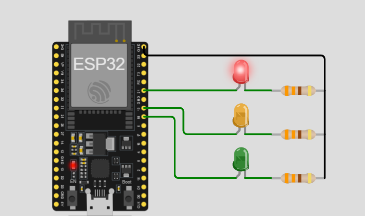

# Activity 1 - Traffic Light System

## Description
This activity will guide you through creating a simple traffic light system using an ESP32. The system will control three LEDs (red, yellow, and green) to simulate a traffic light.

## Skills

- GPIO control
- Timing and delays
- Basic embedded systems programming

## Materials Needed

- ESP32 development board
- Jumper wires
- 3 LEDs (red, yellow, green)
- 3 220Ω resistors

## Screenshot 

