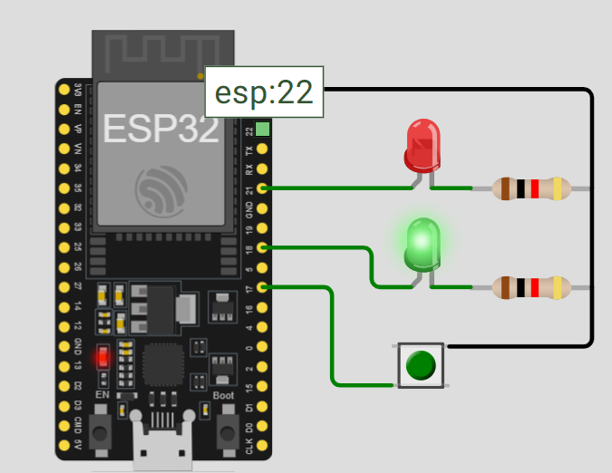

# Activity 2 - Pedestrian Crossing 

## Description

This activity has two led light that simulate real world traffic light system with push button for pedestrian crossing. Whenever the user would hit the button, the traffic light will change to red to signal the vehicles to stop moving and giving them at least one second to get ready before it would turn to red light.

## Materials Used

- ESP32 MCU
- 2pcs 330Ω resistors
- 2pcs LED (green and red)

## Screenshot

