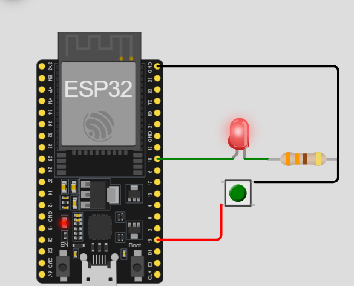

# Activity 3 - PWM Brightness Control with push button

## Description 

This is a demonstration of the led and the power button that works together to show how different level of power looks like. It gives us three different level of brightness that I believe that could be the same logic with how  our electric fan at home works.

## Materials Used

- 1 pcs ESP32 MCU
- 1 pcs LED
- 1 pcs 330 ohm Resistor
- Jumper wires
- Tactile switch button

## Screenshot

