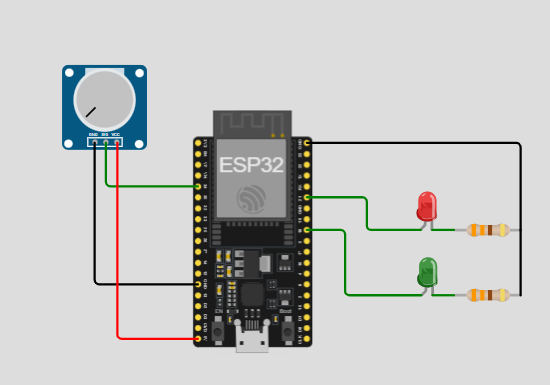

# Activity - 4 Potentiometer Dimmer

## Description 

This activity demonstrate on a situation on our phone - when we increase the brightness of our phone and we have reached the maximum range of the brightness that could potentially endanger not just our eyes but also with the device that we are using. There will be a pop-up warning message that would appear on the screen. This behavior and principle works the same with this activity, instead of warning message - it would be a RED LED that would brighten up to warn us that a certain threshold had reached to the target level so that we can decide whether to turn this off or to just ignore.

## Material Used

- 1 pcs ESP32 MCU
- 2 pcs LED light (green, red)
- 2 pcs 330 ohms Resistor
- Jumper wires

## Screenshot

