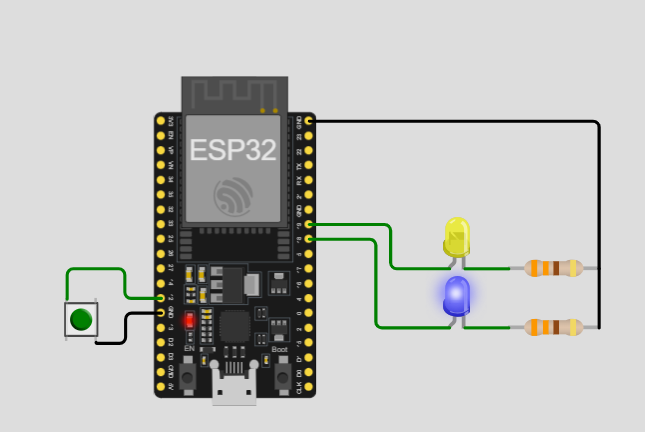

# Activity 5 - Non Blocking Timing with Push Button

## Description 

This activity has two leds that has different way of blinking. The blue led lits for every one second continuously and while the blue led will only blink when push button was pressed. The blue led will still continue blinking regardless the button was pressed or not. This demonstrate how different components can run without affecting the others with the use of the built in system clock called 'millis'.

## Components Used

- 1 pcs ESP32 MCU
- 2 pcs LED (blue, yellow)
- 2 pcs 330 ohms Resistor
- 1 pcs tactile switch / push button
- jumper wires

## ScreenShot

- 