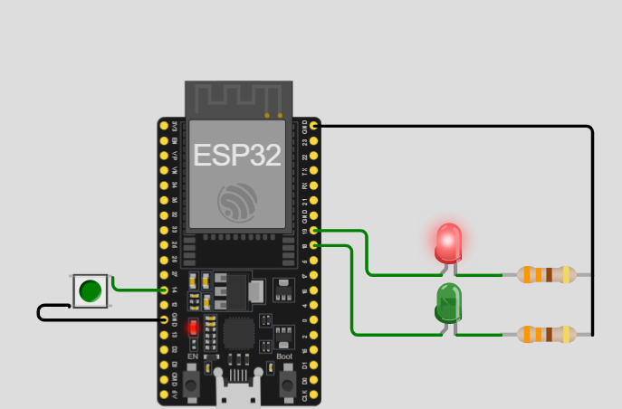

# Activity 6 - Emergency Hardware Stop Interrupt

## Description

Think of some scenario that you need something to give signal to a person that you are drowning or had an emergency situation. This is a benefit of having the option to send signals for help in the most unimaginable case we may have been to. This activity demonstrated on how to do this, when the led is showing green that means that everything is normal but when you see the RED LED lits that means there is something going on and we had to act immediately.

## Components Used

- 1 pcs ESP32 MCU
- 2 pcs LED (green, red)
- 2 pcs 330 ohms Resistor
- 1 pcs Push Button
- Jumper wires

## Screenshot

- 