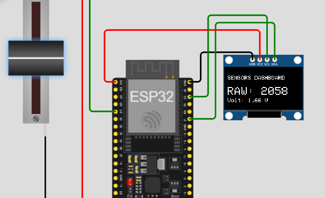

# Activity 7 - Real Time Potentiometer Visualizer

## Description 

Imagine if we need to constantly monitor to know the changes of a temperature in the environment and we would like to see it on screen. That is exactly the same behavior we can see on this activity. Let me show you why - our system uses an OLED screen which is going to display the data that was been read by our ESP32 from the potentiometer which is an alternative component for our temperature sensor. It constantly monitor the voltage raw and the converted equivalent value from the temperature readings - this data will be display on the screen of an OLED component and it will automatically refresh every 100 milliseconds.

## Components Used

- 1 pcs ESP32 MCU
- 1 pcs SSD1306 OLED Display
- Jumper Wires

## Screenshot

