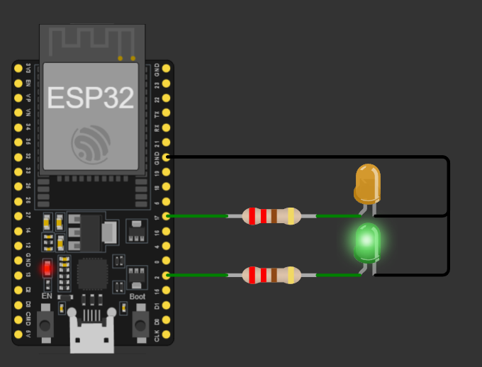

# Activity 8 - Dual Timer Interrupt

## Description

In this activity, we'll use two timers to create a dual timer interrupt. The first timer will trigger an interrupt every second, while the second timer will trigger an interrupt every 5 seconds. It is a very simple example, but it shows how to use multiple timers and interrupts in a single program. This is what we called **event-driven programming**.

## Materials Used

- ESP32 Development Board
- Two 220Ω Resistors
- Two LEDs (Green and Yellow)
- Jumper Wires

## Screenshot

[]
