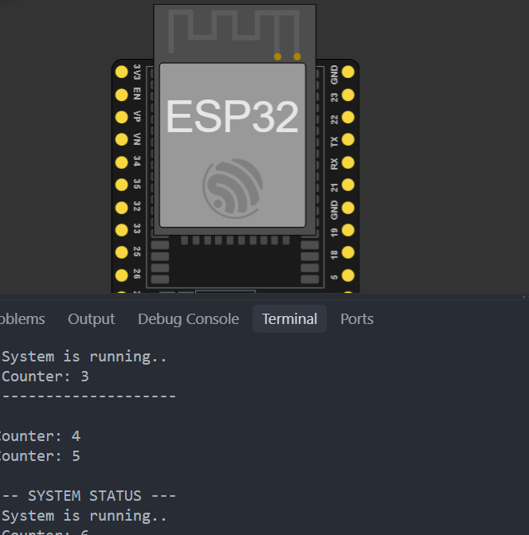

# Activity 9 - FreeRTOS Task Duo

## Description

In this activity, we are going to use FreeRTOS to create a dual task system to print two messages at the same time without blocking the main loop. It is a very simple example, but it shows how to use multiple tasks in a single program. This is the very first foundation to learn for building **responsive, multi-tasking embedded systems** without blocking the processor with `delay()`.

## Materials Used

- ESP32 Development Board

## Screenshot

