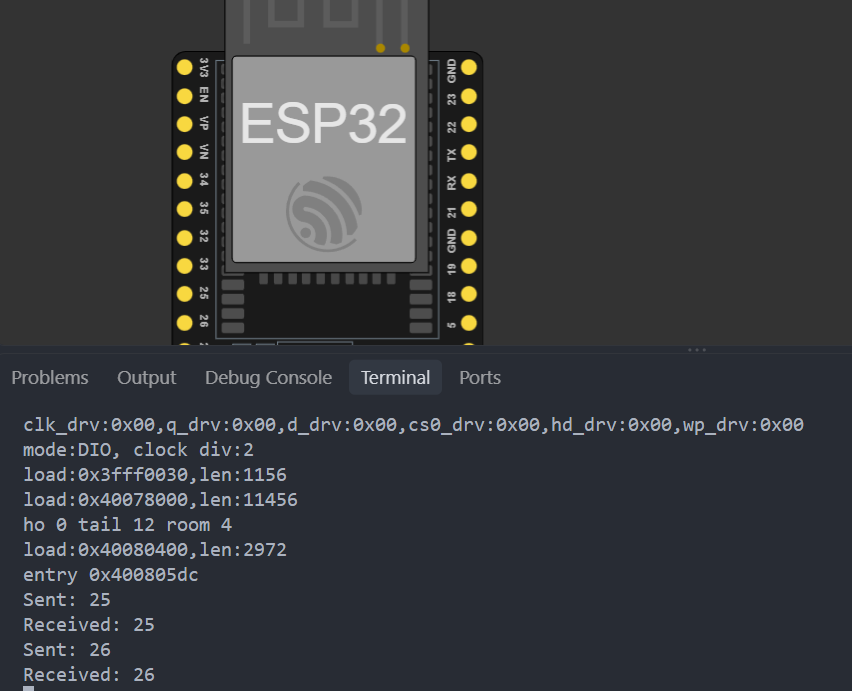

# Activity 10 - FreeRTOS Queue Duo

## Description

In this activity, we are going to use the QueueReceived function to get the data that is in line to ensure that multiple task
that can get the updated data before processing it without blocking the main loop. It is a very simple example, but it shows how to use multiple tasks in a single program. This is the very first foundation to learn for building **responsive, multi-tasking embedded systems** without blocking the processor with `delay()`.

## Materials Used

- ESP32 Development Board

## Screenshot

