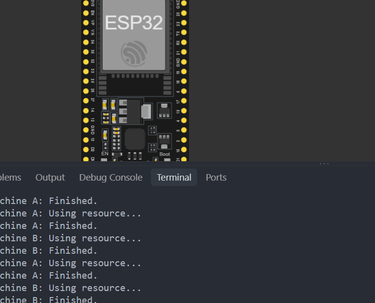

# Activity 11 - FreeRTOS Mutex - Shared Resources

## Description

In this activity, we will learn how to use a FreeRTOS mutex to synchronize access to shared resources. We will use a mutex to ensure that only one task can access a shared resource at a time. This is very useful in embedded systems where multiple tasks may need to access the same resource concurrently. For example, if we have a shared variable that needs to be accessed by multiple tasks, we can use a mutex to ensure that only one task can modify the variable at a time or a shared communication channel that needs to be accessed by multiple tasks.

## Material

- ESP32 Development Board

## Screenshot

