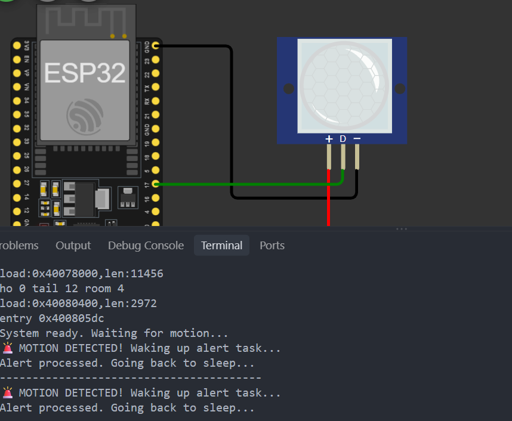

# Activity 12 - FreeRTOS Semaphore - Waking Alert Task

## Description

In this activity, we are going to use the Semaphore to give signal and wake the sleeping task immediately using the ISR. This is very useful in embedded systems where we need to wake up a task that is sleeping to save some resources and the CPU usage. For example, if we have a task that is sleeping for a long period of time until it is woken up by an interrupt, we can use a semaphore to give a signal to the task to wake up and proceed with processing the emergency situation.

## Material

- ESP32 Development Board
- PIR Motion Sensor

## Screenshot

